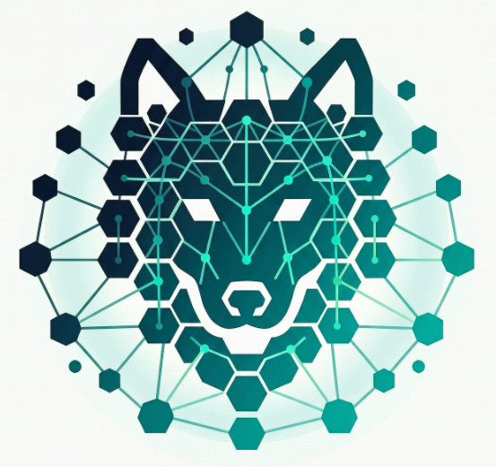
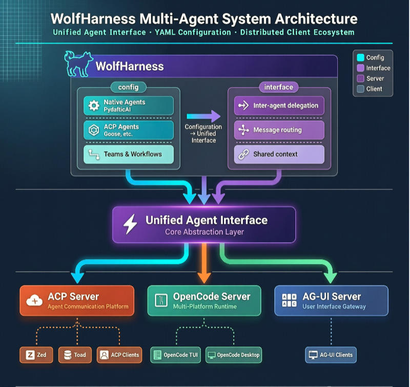

<p align="center">
  
</p>

<h1 align="center">WolfHarness</h1>

<p align="center">
  <a href="https://github.com/wolf1069b/wolfharness/actions/workflows/pytest.yml"></a>
  <a href="https://codecov.io/gh/wolf1069b/wolfharness"></a>
  <a href="https://leoyzen.github.io/wolfharness/"></a>
  <a href="https://github.com/wolf1069b/wolfharness/blob/main/LICENSE"></a>
</p>

> One YAML, every protocol. WolfHarness is a PydanticAI-based framework for orchestrating multi-agent teams and workflows — define agents once, expose them through ACP, OpenCode, MCP, AG-UI, and OpenAI-compatible APIs.

[Documentation](https://leoyzen.github.io/wolfharness/) · [Getting Started](https://leoyzen.github.io/wolfharness/tutorials/) · [API Reference](https://leoyzen.github.io/wolfharness/reference/)

---

## Why WolfHarness?

> With raw frameworks, you write glue code for every agent pair — at 1× speed.  
> With WolfHarness, you define agents once in YAML and use them everywhere — at 10×.

### 1. 🔌 One config, many protocols

Define your agents once in YAML. Then expose them through any protocol — ACP for IDEs, OpenCode for agentic TUI, MCP for tool exposure, or AG-UI for web frontends. No glue code, no duplication.

```yaml
# agents.yml — single source of truth
agents:
  coordinator:
    type: native
    model: openai:gpt-4o
    tools:
      - type: subagent  # Can delegate to all other agents
    system_prompt: "Coordinate tasks between available agents."

  goose:
    type: acp
    provider: goose
    description: "Goose for file operations"
```

```bash
# Serve the same config through any protocol
wolfharness serve-acp agents.yml      # Zed, Toad, ACP clients
wolfharness serve-opencode agents.yml # OpenCode TUI/Desktop
wolfharness serve-mcp agents.yml      # MCP tools for other agents
```

### 2. 🧩 Multi-agent orchestration built in

Agents form teams (parallel), chains (sequential), or complex workflows — all from YAML.

```yaml
teams:
  review_pipeline:
    mode: sequential
    members: [analyzer, reviewer, formatter]

  parallel_coders:
    mode: parallel
    members: [claude, goose]
```

```python
from wolfharness import WolfHarness

async with WolfHarness("agents.yml") as pool:
    # Parallel execution
    results = await (analyzer & reviewer).run("Review this code")
    # Sequential pipeline
    result = await (analyzer | reviewer | formatter).run("Process this")
```

> **Note:** `AgentPool` remains available as a backward-compatible alias for `WolfHarness`.

### 3. 🎯 Rich YAML configuration

Everything is configurable — models, tools, MCP servers, knowledge sources, triggers, connections, storage:

```yaml
agents:
  analyzer:
    type: native
    model:
      type: fallback
      models: [openai:gpt-4o, anthropic:claude-sonnet-4-0]
    tools:
      - type: subagent
      - type: resource_access
    mcp_servers:
      - "uvx mcp-server-filesystem"
    knowledge:
      paths: ["docs/**/*.md"]
    connections:
      - type: node
        name: reporter
        filter_condition:
          type: word_match
          words: [error, warning]
```

## Architecture

<p align="center">
  
</p>

## Key Features

| Category | Features |
|----------|----------|
| **Orchestration** | Teams (parallel), chains (sequential), inter-agent delegation, event-driven triggers |
| **Protocols** | ACP, OpenCode, MCP, AG-UI, OpenAI API-compatible — one config, all protocols |
| **Configuration** | YAML-based agent definition, fallback models, tool registration, MCP server integration |
| **Skills** | Expose `SKILLS.md` files as slash commands across all protocols |
| **Structured Output** | Inline Pydantic schemas or Python types for response validation |
| **Storage & Analytics** | Configurable providers (SQLite, PostgreSQL) for interaction tracking and stats |
| **File Abstraction** | UPath-backed operations on local, S3, SSH, Docker filesystems |
| **Streaming TTS** | Voice output support for all agents |
| **Observability** | Logfire instrumentation on critical paths (RunLoop, Turn, delegation, protocol entry points) |

## Supported Models

WolfHarness is built on **PydanticAI** and supports all its model providers:

| Provider | Models |
|----------|--------|
| **OpenAI** | GPT-4o, GPT-4o-mini, o1, o3, etc. |
| **Anthropic** | Claude Sonnet 4, Claude Opus 4, Claude Haiku 3.5, etc. |
| **Google** | Gemini 2.5 Pro, Gemini 2.5 Flash, etc. |
| **DeepSeek** | DeepSeek V4, DeepSeek R1, etc. |
| **Mistral** | Mistral Large, Mistral Small, etc. |
| **Groq** | Llama, Mixtral, etc. (fast inference) |
| **OpenAI-compatible** | Any OpenAI-protocol endpoint (vLLM, Ollama, Azure, etc.) |

All models support **fallback chains** — configure a primary and fallback, WolfHarness handles the failover:

```yaml
model:
  type: fallback
  models: [openai:gpt-4o, anthropic:claude-sonnet-4-0]
```

## Quick Start

### Installation

```bash
# Recommended — uv
uv tool install wolfharness

# Or pip
pip install wolfharness
```

### Minimal config & run

```yaml
# agents.yml
agents:
  assistant:
    type: native
    model: openai:gpt-4o
    system_prompt: "You are a helpful assistant."
```

```bash
wolfharness run assistant "Hello!"
```

### Start a server

```bash
# ACP server — for Zed, Toad, and other ACP clients
wolfharness serve-acp agents.yml

# OpenCode server — for OpenCode TUI/Desktop
wolfharness serve-opencode agents.yml

# MCP server — expose tools to other agents
wolfharness serve-mcp agents.yml

# AG-UI server — for web frontends
wolfharness serve-agui agents.yml

# OpenAI-compatible API server
wolfharness serve-api agents.yml
```

## Programmatic Usage

```python
from wolfharness import WolfHarness
from pathlib import Path

async with WolfHarness("agents.yml") as pool:
    agent = pool.get_agent("assistant")

    # Simple run
    result = await agent.run("Hello")

    # Streaming
    async for event in agent.run_stream("Tell me a story"):
        print(event)

    # Multi-modal
    result = await agent.run("Describe this", Path("image.jpg"))
```

## CLI Reference

```bash
wolfharness run <name> "prompt"              # Single run
wolfharness serve-acp <config.yml>           # ACP server
wolfharness serve-opencode <config.yml>      # OpenCode server
wolfharness serve-mcp <config.yml>           # MCP server
wolfharness serve-agui <config.yml>          # AG-UI server
wolfharness serve-api <config.yml>           # OpenAI-compatible API
wolfharness watch --config <agents.yml>      # React to triggers
wolfharness history stats --group-by model   # View analytics
wolfharness task <agent_name> "description"  # Create a background task
```

## Roadmap

### 🎯 Project History

| Milestone | Description |
|-----------|-------------|
| **Fork & Rebuild** (2025-12) | Forked from `phil65/agentpool`. Major refactoring: unified SessionPool architecture, EventBus event system, PydanticAI thin wrappers, structured concurrency (anyio), V2 message ID infrastructure, ACP streaming HTTP + WebSocket transport |
| **Feature Expansion** (2026-04) | Pydantic-Graph workflow engine (DAG + conditional branching), M3 capability system with entry-point discovery, M2 lifecycle dimensions (RunLoop/CommChannel/Journal/SnapshotStore), dynamic team mode (RFC-0055), multi-protocol serving (ACP/OpenCode/MCP/AG-UI/OpenAI API) |
| **WolfHarness v4.0** (2026-08) | After extensive testing and stabilization, renamed to WolfHarness — current stable release |

### 📋 Future Plans

The next development phase is under planning. Key candidates include:

- Dynamic workflow capability (RFC-0058) — LLM-authored script-driven multi-agent orchestration
- Agent evaluation & benchmarking framework
- ACP v2 protocol support
- Polyglot agent support (M6)

## Development

### Setup

```bash
git clone https://github.com/wolf1069b/wolfharness
cd wolfharness
uv sync --all-extras
```

### Commands

```bash
uv run pytest                           # Run tests
uv run pytest -m unit                   # Unit tests only
uv run ruff check src/                  # Lint
uv run ruff format src/                 # Format
uv run --no-group docs mypy src/        # Type check
duty lint                               # All checks
```

### Workflow

This project uses **OpenSpec** for all significant changes:

```
/opsx:explore   → Investigate problems, map codebase
/opsx:propose   → Create proposal with design + specs + tasks
/opsx:apply     → Implement tasks
/opsx:archive   → Archive completed change
```

See [`AGENTS.md`](AGENTS.md) for full development setup, code style, and testing conventions. See [`CONTRIBUTING.md`](CONTRIBUTING.md) for contribution guidelines.

## Documentation

Full docs, tutorials, and API reference at **[leoyzen.github.io/wolfharness](https://leoyzen.github.io/wolfharness/)**.

- [Getting Started](https://leoyzen.github.io/wolfharness/tutorials/)
- [Configuration Guide](https://leoyzen.github.io/wolfharness/how-to/)
- [Architecture](https://leoyzen.github.io/wolfharness/explanation/)
- [API Reference](https://leoyzen.github.io/wolfharness/reference/)

## Contributors

Thanks to everyone who has contributed to WolfHarness!

[](https://github.com/wolf1069b/wolfharness/graphs/contributors)

**Key contributors:** [Philipp Temminghoff](https://github.com/phil65) (original author), [Leoyzen](https://github.com/Leoyzen) (maintainer), [Million](https://github.com/Million-mo), [yankaifeng](https://github.com/yankaifeng), [tasia](https://github.com/tasiawang), and the broader iroot-llm team.

## Citation

If you use WolfHarness in your research or project, please cite:

```bibtex
@software{wolfharness2025,
  author  = {{WolfHarness Contributors}},
  title   = {WolfHarness: PydanticAI-based Multi-Agent Orchestration Framework},
  year    = {2025},
  url     = {https://github.com/wolf1069b/wolfharness},
  license = {MIT}
}
```

## Migrating from AgentPool

This project was renamed from **AgentPool** to **WolfHarness** (v2.10+). Backward-compatible shims are in place to ease the transition:

| Old | New | Status |
|-----|-----|--------|
| `import agentpool` | `import wolfharness` | ✅ Shim with deprecation warning |
| `import agentpool_cli` | `import wolfharness_cli` | ✅ Shim with deprecation warning |
| `import agentpool_config` | `import wolfharness_config` | ✅ Shim with deprecation warning |
| `import agentpool_server` | `import wolfharness_server` | ✅ Shim with deprecation warning |
| `import agentpool_storage` | `import wolfharness_storage` | ✅ Shim with deprecation warning |
| `import agentpool_toolsets` | `import wolfharness_toolsets` | ✅ Shim with deprecation warning |
| `agentpool run ...` | `wolfharness run ...` | ✅ CLI alias with deprecation warning |
| `AGENTPOOL_CONFIG_DIR` env var | `WOLFHARNESS_CONFIG_DIR` | ⚠️ Still supported, migrate when convenient |

The shims emit a `DeprecationWarning` and will be removed in a future release. Please update your imports and scripts accordingly.

## License

MIT — see [LICENSE](LICENSE).

---

<p align="center">
  <em>Built on</em> &nbsp;
  <a href="https://github.com/pydantic/pydantic-ai">PydanticAI</a> ·
  <a href="https://github.com/anthropics/anthropic-claude-protocol">ACP</a> ·
  <a href="https://github.com/sst/opencode">OpenCode</a> ·
  <a href="https://github.com/modelcontextprotocol">MCP</a>
</p>

<p align="center">
  <em>WolfHarness is a fork of</em> <a href="https://github.com/phil65/agentpool">phil65/agentpool</a> <em>by Philipp Temminghoff. Grateful for the foundational work and ongoing inspiration from the upstream project.</em>
</p>
