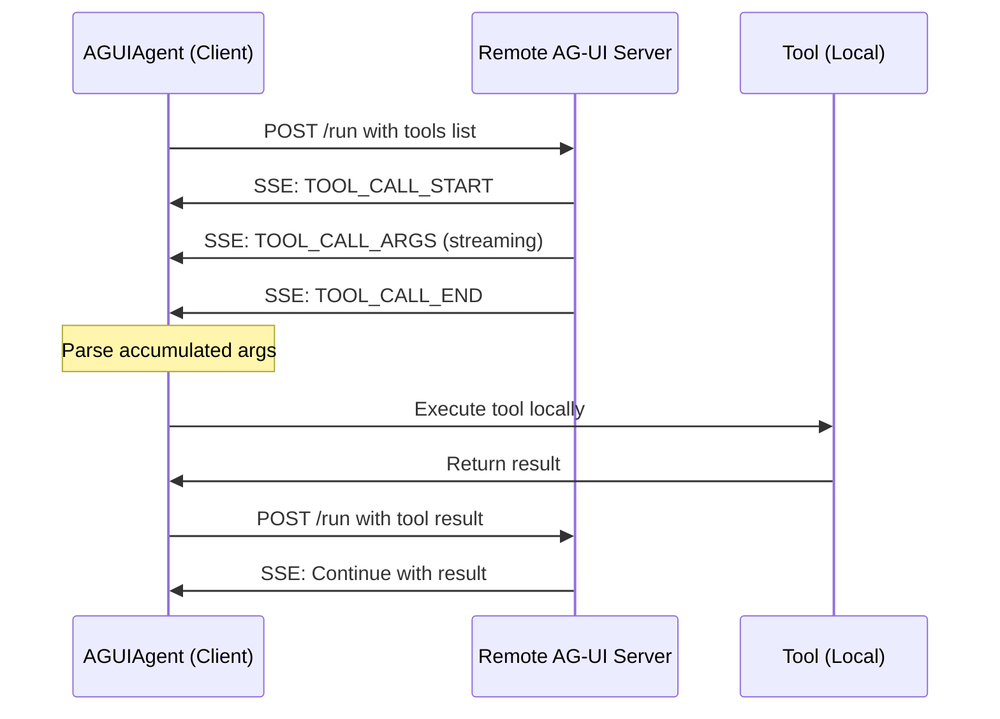

# AG-UI Integration

## What is AG-UI?

AG-UI (Agent User Interaction Protocol) is a standardized protocol for connecting frontend applications to AI agents. It enables:

- **Bidirectional Communication**: Agents stream events to frontends, frontends send requests and tool results
- **Real-time Updates**: Server-Sent Events (SSE) for streaming responses
- **Client-Side Tools**: Tools defined and executed in the frontend for human-in-the-loop workflows
- **Transport Flexibility**: HTTP/SSE or binary protocols

Unlike ACP (which uses stdio/JSON-RPC for IDE integration), AG-UI is designed for web applications and uses HTTP with SSE streaming.

## AG-UI Agents: The Client Side

In wolfharness, `AGUIAgent` acts as a **client** that connects **to** remote AG-UI servers. This allows you to:

- Integrate external AG-UI agents into your agent pool
- Compose remote agents with native wolfharnesss via connections and teams
- Execute tools locally while letting remote agents decide when to use them
- Maintain unified messaging and event systems

!!! note "Client vs Server"
    Currently, wolfharness provides the **client side** (consuming AG-UI agents). 
    Server-side support (exposing wolfharnesss as AG-UI endpoints) is planned for future releases.

## Installation

No additional installation required - AG-UI support is included in wolfharness:

```bash
pip install wolfharness
# or
uv add wolfharness
```

The `ag-ui` Python package is a dependency and provides the protocol types.

## Basic Usage

### Connecting to an AG-UI Agent

```python
from wolfharness.agents import AGUIAgent

async def main():
    # Connect to a remote AG-UI agent
    async with AGUIAgent(
        endpoint="http://localhost:8000/agent/run",
        name="remote-assistant",
        description="External AG-UI agent",
    ) as agent:
        # Use like any other agent
        result = await agent.run("Hello, world!")
        print(result.content)
        
        # Stream responses
        async for event in agent.run_stream("Tell me a story"):
            print(event)
```

### Configuration File

Define AG-UI agents in your configuration:

```yaml title="agents.yml"
agents:
  remote_assistant:
    type: agui
    endpoint: http://localhost:8000/agent/run
    timeout: 60.0
    headers:
      Authorization: Bearer ${API_KEY}
    description: External AG-UI powered agent
    
  managed_agent:
    type: agui
    endpoint: http://localhost:8765/agent/run
    startup_command: "uv run ag-ui-server config.yml"
    startup_delay: 3.0
    description: Auto-started AG-UI agent
```

Load and use:

```python
from wolfharness import AgentPool

async def main():
    async with AgentPool("agents.yml") as pool:
        agent = pool.get_agent("remote_assistant")
        result = await agent.run("What can you do?")
```

## Client-Side Tool Execution

AG-UI's most powerful feature is client-side tools: tools are **defined locally**, sent to the remote agent, and **executed locally** when the agent requests them.

### Why Client-Side Tools?

- **Human-in-the-Loop**: Agent can request user confirmation/input
- **Local Capabilities**: Expose local resources to remote agents
- **Security**: Sensitive operations stay under client control
- **Flexibility**: Different frontends can provide different tools

### Tool Flow



### Registering Tools

```yaml title="agents.yml"
agents:
  tool_enabled_agent:
    type: agui
    endpoint: http://localhost:8000/agent/run
    tools:
      - import_path: myapp.tools.confirm_action
        name: confirm_action
        description: Ask user to confirm important actions
      - import_path: myapp.tools.fetch_data
        name: fetch_data
        description: Retrieve data from local sources
```


### Tool Execution

When the remote agent calls a tool:

1. **Request**: Agent streams `TOOL_CALL_START` → `TOOL_CALL_ARGS` → `TOOL_CALL_END`
2. **Execution**: AGUIAgent executes the tool locally with parsed arguments
3. **Result**: Client sends tool result in a continuation request
4. **Continuation**: Agent processes result and continues

All of this is automatic - you just register tools and they work.


## Agent Pool Integration

AG-UI agents work seamlessly with the agent pool:

```yaml title="agents.yml"
agents:
  local_assistant:
    type: native
    model: openai:gpt-4
    system_prompt: You are a helpful assistant
  remote_specialist:
    type: agui
    endpoint: http://specialist-server.com/agent/run
    tools:
      - import_path: tools.confirm
      
teams:
  hybrid_team:
    members:
      - local_assistant
      - remote_specialist
    strategy: parallel
```

Use in code:

```python
async with AgentPool("agents.yml") as pool:
    # Get individual agents
    local = pool.get_agent("local_assistant")
    remote = pool.get_agent("remote_specialist")
    
    # Or use the team
    team = pool.get_team("hybrid_team")
    result = await team.run("Process this request")
```

## Configuration Options

### Basic Options

```yaml
agents:
  my_agent:
    type: agui
    endpoint: http://localhost:8000/agent/run  # Required
    name: my_agent                              # Optional, defaults to key
    description: Agent description              # Optional
    display_name: My Agent                      # Optional, for UI
    timeout: 60.0                               # Request timeout (seconds)
```

### Authentication

```yaml
agents:
  authenticated_agent:
    type: agui
    endpoint: https://api.example.com/agent/run
    headers:
      Authorization: Bearer ${API_TOKEN}
      X-Custom-Header: ${CUSTOM_VALUE}
```

### Managed Servers

For testing, have AGUIAgent start and manage the server:

```yaml
agents:
  test_agent:
    type: agui
    endpoint: http://localhost:8765/agent/run
    startup_command: "uv run ag-ui-server config.yml"
    startup_delay: 2.0  # Wait 2 seconds after starting
```

The server is automatically started on context entry and stopped on exit.

### With Tools

```yaml
agents:
  tool_agent:
    type: agui
    endpoint: http://localhost:8000/agent/run
    tools:
      - import_path: mypackage.tools.tool_one
        name: custom_name          # Override name
        description: Custom desc   # Override description
        enabled: true             # Can disable individual tools
      - import_path: mypackage.tools.tool_two
```

### With MCP Servers

AG-UI agents can use MCP servers for additional capabilities:

```yaml
agents:
  enhanced_agent:
    type: agui
    endpoint: http://localhost:8000/agent/run
    mcp_servers:
      - name: filesystem
        type: stdio
        command: npx
        args: ["-y", "@modelcontextprotocol/server-filesystem"]
```

## Event Handling

AG-UI agents emit the same events as native agents:

```python
from wolfharness.agents.events import ToolCallStartEvent

async def tool_call_handler(ctx, event):
    if isinstance(event, ToolCallStartEvent):
        print(f"Tool called: {event.tool_name}")

async with AGUIAgent(
    endpoint="http://localhost:8000/agent/run",
    event_handlers=[tool_call_handler],
) as agent:
    result = await agent.run("Use a tool")
```

## AG-UI vs ACP Comparison

| Aspect | AG-UI | ACP |
|--------|-------|-----|
| **Purpose** | Web frontend integration | IDE integration |
| **Transport** | HTTP + SSE | stdio + JSON-RPC |
| **Tools** | Frontend-defined (client-side) | Agent-defined (server-side) |
| **Use Case** | Chat UIs, web apps | Code editors, terminals |
| **AgentPool Role** | Client (consumer) | Both client & server |

## Best Practices

### Tool Design

1. **Keep tools focused**: Each tool should do one thing well
2. **Provide clear descriptions**: Help the agent understand when to use tools
3. **Use type hints**: Enables automatic JSON Schema generation
4. **Handle errors gracefully**: Tools should catch and return meaningful errors

### Security

1. **Validate tool inputs**: Don't trust arguments from remote agents
2. **Use confirmation for destructive actions**: Critical operations need user approval
3. **Limit tool scope**: Only expose necessary capabilities
4. **Use authentication**: Secure your AG-UI endpoints with headers

### Performance

1. **Set appropriate timeouts**: AG-UI calls can be long-running
2. **Consider tool complexity**: Heavy operations might need async execution
3. **Monitor streaming**: Handle SSE connection issues gracefully

## Troubleshooting


## Future: AG-UI Server Support

Future versions will support exposing wolfharnesss **as** AG-UI servers:

```yaml title="Future feature"
agui_server:
  port: 8000
  agents:
    - my_local_agent
  cors_origins:
    - http://localhost:3000
```

This will enable:

- Frontends directly connecting to wolfharnesss
- Web UI integration
- Bidirectional AG-UI workflows


## External Resources

- [AG-UI Protocol Specification](https://docs.ag-ui.com/)
- [AG-UI GitHub Repository](https://github.com/CopilotKit/ag-ui)
- [CopilotKit Documentation](https://docs.copilotkit.ai/)
