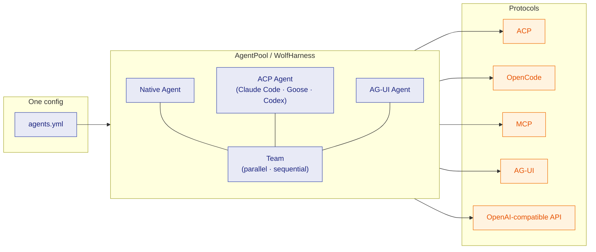

**Connect all the agents!**

<p align="center">
  <a href="https://github.com/wolf1069b/wolfharness/actions/workflows/pytest.yml"></a>
  <a href="https://codecov.io/gh/wolf1069b/wolfharness"></a>
  <a href="https://pypi.org/project/wolfharness/"></a>
  <a href="https://pypi.org/project/wolfharness/"></a>
  <a href="https://pypi.org/project/wolfharness/"></a>
  <a href="https://github.com/wolf1069b/wolfharness/stargazers"></a>
  <a href="https://github.com/wolf1069b/wolfharness/blob/main/LICENSE"></a>
</p>

## Architecture

Define your agents once in YAML, then expose them through any protocol. WolfHarness sits at the center — every node is a `MessageNode`, so native agents, remote (ACP / AG-UI) agents, and teams compose seamlessly:



## Key Features

### Slash Commands

Skills exposed as slash commands across all supported protocols (ACP, AG-UI, OpenCode):

- Define reusable skill instructions in SKILL.md files
- Automatically exposed as protocol-native commands
- Use `/skill:my-skill` in OpenCode, `skill__my-skill` tool in AG-UI, or slash commands in ACP

### ACP Integration

First-class support for the Agent Client Protocol (ACP):

- Integrate directly into IDEs like Zed, VS Code, and others
- Wrap external agents (Claude Code, Goose, Codex, fast-agent) as nodes
- Unified node abstraction - ACP agents work like native agents
- Compose ACP agents into teams with native agents

### 📝 Easy Agent Configuration

AgentPool excels at static YAML-based agent configuration:

- Define agents with extreme detail in pure YAML (Pydantic-backed)
- Expansive JSON schema for IDE autocompletion and validation, backed by an extremely detailed schema.
- Multi-Agent setups with native as well as remote (ACP / AGUI) agents


### 🧩 Unified Node Architecture

Everything is a MessageNode - enabling seamless composition:

- **Native** agents with a large set of default tools
- **ACP** agents
- **AG-UI** agents
- Teams (parallel and sequential)
- Human-in-the-loop-agents
- All nodes share the same interface


## Dependencies

| Category | Representative Packages |
|---|---|
| **Framework & AI** | `pydantic`, `pydantic-ai-slim`, `pydantic-graph` |
| **Web, Server & Protocols** | `fastapi`, `mcp`, `starlette`, `uvicorn`, `websockets` |
| **Storage & Database** | `sqlalchemy`, `sqlmodel`, `alembic` |
| **CLI & Configuration** | `typer`, `rich`, `yamling`, `schemez` |
| **Async, IO & Execution** | `anyio`, `anyenv`, `fsspec`, `watchfiles` |
| **Observability** | `logfire`, `structlog` |
| **Documents & Search** | `docler`, `searchly`, `ripgrep-rs`, `tokonomics` |
| **Tooling & Events** | `jinja2`, `psygnal`, `evented`, `slashed`, `pydocket` |

> See the [full dependency list](tutorials/dependencies.md) for complete details and version info.

## License

MIT License - see [LICENSE](https://github.com/Leoyzen/wolfharness/blob/main/LICENSE) for details.

## Documentation

- [Tutorials](tutorials/index.md) — Getting started and learning guides
- [How-To Guides](how-to/) — Task-oriented guides for configuration, servers, and advanced features
- [Reference](reference/) — CLI commands, core concepts, and API reference
- [Architecture](explanation/) — How and why AgentPool works
- [Decision Records](adr/) — Architecture Decision Records (ADRs)
- [RFCs](rfcs/STATUS.md) — Request for Comments proposals and status
- [Documentation Guide](meta/documentation-guide.md) — Where to put new documentation

## Why choose WolfHarness?

> **With raw frameworks, you write glue code for every agent pair — at 1× speed.**
> With WolfHarness, you define agents once in YAML and use them everywhere — at 10×.

### Versus hand-writing the glue

If you build multi-agent systems directly on `pydantic-ai` or raw MCP, every agent-to-agent interaction, every protocol binding, every team orchestration is **code you write and maintain yourself**. WolfHarness replaces that plumbing with declarative YAML.

| | Hand-rolled glue | WolfHarness |
|---|---|---|
| **Define an agent** | Subclass, wire model + tools in code | A few lines of YAML |
| **Expose over ACP** | Write a server, hand-roll transport | `wolfharness serve-acp agents.yml` |
| **Team up agents** | Manual message passing, state mgmt | Declarative teams (`parallel` / `sequential`) |
| **Persist state / history** | Build your own storage layer | Built-in SQLite / PostgreSQL providers |
| **Human-in-the-loop** | Custom approval plumbing | First-class prompting + permission nodes |

### One config, every protocol

You are not locked into one runtime — the **same `agents.yml`** serves as an ACP server, an OpenCode endpoint, an MCP tool provider, an AG-UI backend, or an OpenAI-compatible API. Add or drop a protocol without changing your agent definitions.

### Built on a modern, typed core

- **PydanticAI + Pydantic** under the hood — validated, excellently typed, fully async
- `MessageNode` abstraction — native agents, remote agents, and teams share one interface
- **Observability first** — Logfire instrumentation on critical paths out of the box

## Quick Start

### Basic Agent Configuration

```yaml
# agents.yml
agents:
  assistant:
    display_name: "Technical Assistant"
    model: openai:gpt-4
    system_prompt: You are a helpful technical assistant.
    tools:
      - type: file_access
```

### Python Usage

```python
from wolfharness import AgentPool

async def main():
    async with AgentPool("agents.yml") as pool:
        agent = pool.get_agent("assistant")
        response = await agent.run("What is Python?")
        print(response.data)

if __name__ == "__main__":
    import anyio
    anyio.run(main)
```
